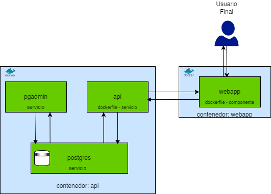

# 1. PRUEBA TÉCNICA DESARROLLO

## DESCRIPCIÓN DEL PROBLEMA

La empresa Celsia Internet S.A.S. requiere implementar una solución para su proceso de venta que permita la captura de información de los clientes y la contratación de uno o varios servicios del portafolio de internet.

El ejercicio consiste en implementar un backend y frontend con su configuración de despliegue en contenedores, para el registro y consulta de la información de los servicios contratados por los clientes, de acuerdo con el modelo de datos presentado a continuación.

## MODELO DE DATOS

Las tablas donde se almacena la información son las siguientes:

```console
CREATE TABLE clientes {
  identificacion VARCHAR(20) NOT NUL PRIMARY KEY,
  nombres VARCHAR(80) NOT NULL,
  apellidos VARCHAR(80) NOT NULL,
  tipoIdentificacion VARCHAR(2) NOT NULL,
  fechaNacimiento DATE NOT NULL,
  numeroCelular VARCHAR(20) NOT NULL,
  correoElectronico VARCHAR(80) NOT NULL
};


CREATE TABLE servicios {
  identificacion VARCHAR(20) NOT NUL,
  servicio VARCHAR(80) NOT NUL,
  fechaInicio DATE NOT NULL,
  ultimaFacturacion DATE NOT NULL,
  ultimoPago INTEGER NOT NUL DEFAULT 0,
  PRIMARY KEY (identificacion, servicio),
  CONSTRAINT servicios_FK1 FOREING KEY (identificacion) REFERENCES clientes(identificacion) ON UPDATE CASCADE ON DELETE NO ACTION
}
```

Para la prueba se deben crear las tablas en el motor de base de datos de su preferencia. Sobre esta base se deben almacenar los registros de los clientes y servicios que se especifican para la prueba.

## Puntos de la prueba

1.1. Implemente en el lenguaje de su preferencia, una `CRUD (Create, Read, Update and Delete)` que permita capturar y administrar la información de los clientes y sus servicios.

1.2. Se deben realizar las siguientes validaciones:

- No dejar datos en blanco.
- El tipo de dato, de acuerdo con la estructura en la base de datos.
- Si el registro ya existe muestre el mensaje `“El registro ya existe”`.

  1.3. Implementar un formulario que permita registrar los servicios contratados de los clientes. `Nota: Tener en cuenta integridad referencial.`

  1.4. Implementar un formulario para la consulta por número de identificación, la información de un cliente y los servicios que tiene contratados.

TIPS:

a. Para el campo `tipoIdentificacion` ingresar solamente los siguientes valores:

- CEDULA → CC
- TARJETA IDENTIDAD → TI
- CEDULA EXTRANJERIA → CE
- REGISTRO CIVIL → RC

b. Para el campo `servicio` ingresar solamente los siguientes tipos:

- Internet 200 MB
- Internet 400 MB
- Internet 600 MB
- Directv Go
- Paramount+
- Win+

c. Se evaluará el uso de patrones de diseño, en backend y frontend, la configuración de despliegue en contenedores y de la imagen a desplegar.

d. En el docker-compose se debe incluir la configuración del servicio de base de datos que haya escogido y una política de manejo de logs para cada servicio.

## ENTREGABLE

Se espera como resultado un clone del repositorio `https://github.com/celsia-internet/pruebas.git`, con la siguiente estructura.

```
api/
|-- docker-compose.yml
|-- Dockerfile
|-- README.md
|-- ...
webapp/
|-- docker-compose.yml
|-- Dockerfile
|-- README.md
|-- ...
```

El repositorio de la prueba deberá estar publicado en `github` de manera pública con el nombre `prueba-celsia-internet` usando git-flow por desarrollador.

```
main/
|-- develop
||-- <desarrollador>
```

# 2. PRUEBA TEORICO-PRACTICA

Para el desarrollo de la prueba teórica, tendrás que escribir tus respuestas en el archivo README.md del repositorio, tomando como referencia la aplicación desarrollada en la `PRUEBA TÉCNICA DE DESARROLLO`.

## PREGUNTAS

2.1. Elabore un diagrama de componentes de la aplicación. Debe cargar el archivo en la siguiente ruta del repositorio: `./assets/diagrama.png`

- RTA: 

  2.2. ¿Qué mecanismos de seguridad incluirías en la aplicación para garantizar la protección del acceso a los datos?

- RTA:

  2.3. ¿Qué estrategia de escalabilidad recomendarías para la aplicación considerando que el crecimiento proyectado será de 1,000,000 de clientes por año?

  Seguir dockerizando para garantizar flexibilidad en el uso de herramientas y entornos. Por otra parte, recomendaria manejar todos los rest api como microservicios y los webapp como componentes separados de esta forma, se puede modularizar todas las herramientas y aplicativos que surjan a lo largo del año.

  Considerar usar un servicio de elasticSearch en caso de necesitar realizar consultas mas rapidas y flexibles, ya que en un escenaro de un millon de clientes el front de la forma que traiga todos los usuarios por paginado o consulta no es muy efectivo.

  Por ultimo, ya que la REST esta hecha en go, podria aprovecharse la capacidad que tiene el lenguaje para hacer hilos de tareas concurrentemente y asi realizar peticiones por medio de workers

- RTA:

  2.4. ¿Qué patrón o patrones de diseño recomendarías para esta solución y cómo se implementarían? (Justifique)

  Recomendaria el patron repository, ya que permite que cada segmento de codigo se haga por separado y de una funcion en especifico, asi no se depende de una herramienta o implementacion en particular, sino que se maneja una abstraccion de cada implementacion por medio de este patron. Esto facilita por ejemplo al momento de querer alternar entre diferentes integraciones que traigan diferente informacion y estandarizar el procesamiento de dicha informacion

  Otro patron a tener en cuenta es el singleton, el cual permite manejar una sola instancia de cada objeto en mi aplicativo.

- RTA:

  2.5. ¿Qué recomendaciones harías para optimizar el manejo y la persistencia de datos de la aplicación, teniendo en cuenta que esta aplicación tiene una alta transaccionalidad?

  Como mencione anteriormente, en orden del manejo de la data seria recomendable contar con algun servicio de ElasticSearch como ZincSearch para tener mas flexibilidad en la busqueda.

  Por otra parte, considerando que el aplicativo inicia con un modelo relacional, puede mantenerse de esa forma pero si recomendaria implementar LINQ para facilitar la capacidad de consulta y flexibilidad a la hora de crear atributos de relaciones.

- RTA:

# 3. Redes

3.1. Explica la diferencia entre un router y un switch. ¿Cuándo usarías cada uno?

La diferencia entre un router y un switch radica en que el router es un enrutador mientras que el switch es un conmutador.

El router permite conectar multiples redes entre si, por ejemplo, las ONTs son routers que permiten conectar la red local LAN a internet.

Por otra parte, un switch es el orquestador o conmutador que permite conectar varios dispositivos a una misma red. Este dispositivo recibe los datos y es encargado de enviarlos a su destino dentro de la misma red. Por ejemplo en una casa entre un celular un computador y una impresora, el switch es el que permite la conexion y comunicacion entre estos dispositivos.

¿Cuando los usaria?

¿Quiero conectar una red privada o domestica a internet? Router
¿Quiero conectar varios dispositivos de mi hogar a una misma red y coordinar su comunicacion? Switch

- RTA:

  3.2. Describe las siete capas del modelo OSI y menciona brevemente la función principal de cada una

  El modelo OSI describe 7 capas para estandarizar las funciones y capacidades de una red.

  El orden seria:

  - 1. Capa Fisica
       El mas bajo nivel, aqui se definen las caracteristicas fisicas como lo que viene siendo los cables y su señalizacion y transmision binaria.
  - 2. Enlace de datos
       Aqui se realiza la verificacion de errores y todo lo que viene siendo el direccionamiento fisico
  - 3. Red
       En esta capa se realiza es el direccionamiento logico, es decir, establecer las rutas
  - 4. Transporte
       En la capa de transporte se realiza la conexion de extremo a extremo entre dispositivos
  - 5. Sesion
       Es la encargada de mantener el dialogo o comunicacion entre ambos dispositivos de red
  - 6. Presentacion
       En esta abstraccion se realiza el interpretado de la informacion intercambiada, es decir, la escriptacion.
  - 7. Aplicacion
       Capa que se entrega al usuario final que es, practicamente el servicio de red.

- RTA:

  3.3. Explica las diferencias entre los protocolos TCP y UDP. Dar un ejemplo de cuándo usarías cada uno?

  El protocolo TCP (Transmission Control Protocol) se encarga de asegurar una conexión entre emisor y receptor previo a que los datos se envien, por esta razon asegura el paso de informacion entre ambos dispositivos. Este protocolo es utilizado cuando se debe enviar informacion sin que se vea afectada la integridad de los datos, ademas de asegurar la entrega de la misma, por esa razon es usado en la navegacion web.

  Por otra parte esta el User Datagram Protocol, el cual no garantiza una conexion ni una entrega de la informacion. Sin embargo, tiene ventajas como la rapidez ya que no necesita confirmar un receptor. Este protocolo es usado en aplicaciones que priorizan la rapidez y las actualizaciones frecuentes mas que la validez y exactitud de toda la informacion entregada, por ejemplo, los juegos o transmisiones.

- RTA:

  3.4. ¿Qué es una máscara de subred y cómo se utiliza para dividir una red en subredes más pequeñas?

- RTA:

  3.5. ¿Puedes mencionar algunos protocolos de enrutamiento dinámico y explicar brevemente cómo funcionan?

- RTA:

### Por último, y no menos importante, te deseamos mucha suerte y esperamos que disfrutes haciendo la prueba. El objetivo es evaluar tu conocimiento, capacidad de adaptabilidad y habilidad para resolver problemas.
